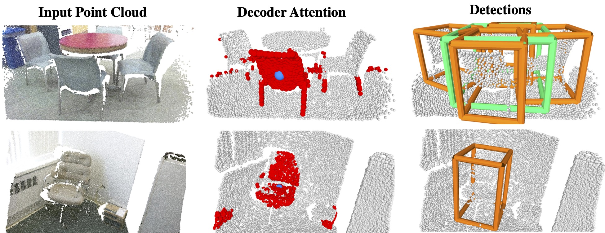

# 3DETR: An End-to-End Transformer Model for 3D Object Detection

PyTorch implementation and models for **3DETR**.

**3DETR** (**3D** **DE**tection **TR**ansformer) is a simpler alternative to complex hand-crafted 3D detection pipelines.
It does not rely on 3D backbones such as PointNet++ and uses few 3D-specific operators.
3DETR obtains comparable or better performance than 3D detection methods such as VoteNet.
The encoder can also be used for other 3D tasks such as shape classification.
More details in the paper ["An End-to-End Transformer Model for 3D Object Detection"](http://arxiv.org/abs/2109.08141).

[[website](https://facebookresearch.github.io/3detr)] [[arXiv](http://arxiv.org/abs/2109.08141)] [[bibtex](#Citation)]

**Code description.** Our code is based on prior work such as DETR and VoteNet and we aim for simplicity in our implementation. We hope it can ease research in 3D detection.




# Pretrained Models

We provide the pretrained model weights and the corresponding metrics on the val set (per class APs, Recalls).
We provide a Python script [`utils/download_weights.py`](utils/download_weights.py) to easily download the weights/metrics files.

<table>
<tr>
<th>Arch</th>
<th>Dataset</th>
<th>Epochs</th>
<th>AP25</th>
<th>AP50</th>
<th>Model weights</th>
<th>Eval metrics</th>
</tr>
<tr>
<td>3DETR-m</td>
<td>SUN RGB-D</td>
<td>1080</td>
<td>59.1</td>
<td>30.3</td>
<td><a href="https://dl.fbaipublicfiles.com/3detr/checkpoints/sunrgbd_masked_ep1080.pth">weights</a></td>
<td><a href="https://dl.fbaipublicfiles.com/3detr/checkpoints/sunrgbd_masked_ep1080_metrics.pkl">metrics</a></td>
</tr>
<tr>
<td>3DETR</td>
<td>SUN RGB-D</td>
<td>1080</td>
<td>58.0</td>
<td>30.3</td>
<td><a href="https://dl.fbaipublicfiles.com/3detr/checkpoints/sunrgbd_ep1080.pth">weights</a></td>
<td><a href="https://dl.fbaipublicfiles.com/3detr/checkpoints/sunrgbd_ep1080_metrics.pkl">metrics</a></td>
</tr>
<tr>
<td>3DETR-m</td>
<td>ScanNet</td>
<td>1080</td>
<td>65.0</td>
<td>47.0</td>
<td><a href="https://dl.fbaipublicfiles.com/3detr/checkpoints/scannet_masked_ep1080.pth">weights</a></td>
<td><a href="https://dl.fbaipublicfiles.com/3detr/checkpoints/scannet_masked_ep1080_metrics.pkl">metrics</a></td>
</tr>
<tr>
<td>3DETR</td>
<td>ScanNet</td>
<td>1080</td>
<td>62.1</td>
<td>37.9</td>
<td><a href="https://dl.fbaipublicfiles.com/3detr/checkpoints/scannet_ep1080.pth">weights</a></td>
<td><a href="https://dl.fbaipublicfiles.com/3detr/checkpoints/scannet_ep1080_metrics.pkl">metrics</a></td>
</tr>
</table>

## Model Zoo

For convenience, we provide model weights for 3DETR trained for different number of epochs.

<table>
<tr>
<th>Arch</th>
<th>Dataset</th>
<th>Epochs</th>
<th>AP25</th>
<th>AP50</th>
<th>Model weights</th>
<th>Eval metrics</th>
</tr>
<tr>
<td>3DETR-m</td>
<td>SUN RGB-D</td>
<td>90</td>
<td>51.0</td>
<td>22.0</td>
<td><a href="https://dl.fbaipublicfiles.com/3detr/checkpoints/sunrgbd_masked_ep90.pth">weights</a></td>
<td><a href="https://dl.fbaipublicfiles.com/3detr/checkpoints/sunrgbd_masked_ep90_metrics.pkl">metrics</a></td>
</tr>
<tr>
<td>3DETR-m</td>
<td>SUN RGB-D</td>
<td>180</td>
<td>55.6</td>
<td>27.5</td>
<td><a href="https://dl.fbaipublicfiles.com/3detr/checkpoints/sunrgbd_masked_ep180.pth">weights</a></td>
<td><a href="https://dl.fbaipublicfiles.com/3detr/checkpoints/sunrgbd_masked_ep180_metrics.pkl">metrics</a></td>
</tr>
<tr>
<td>3DETR-m</td>
<td>SUN RGB-D</td>
<td>360</td>
<td>58.2</td>
<td>30.6</td>
<td><a href="https://dl.fbaipublicfiles.com/3detr/checkpoints/sunrgbd_masked_ep360.pth">weights</a></td>
<td><a href="https://dl.fbaipublicfiles.com/3detr/checkpoints/sunrgbd_masked_ep360_metrics.pkl">metrics</a></td>
</tr>
<tr>
<td>3DETR-m</td>
<td>SUN RGB-D</td>
<td>720</td>
<td>58.1</td>
<td>30.4</td>
<td><a href="https://dl.fbaipublicfiles.com/3detr/checkpoints/sunrgbd_masked_ep720.pth">weights</a></td>
<td><a href="https://dl.fbaipublicfiles.com/3detr/checkpoints/sunrgbd_masked_ep720_metrics.pkl">metrics</a></td>
</tr>
<tr>
<td>3DETR</td>
<td>SUN RGB-D</td>
<td>90</td>
<td>43.7</td>
<td>16.2</td>
<td><a href="https://dl.fbaipublicfiles.com/3detr/checkpoints/sunrgbd_ep90.pth">weights</a></td>
<td><a href="https://dl.fbaipublicfiles.com/3detr/checkpoints/sunrgbd_ep90_metrics.pkl">metrics</a></td>
</tr>
<tr>
<td>3DETR</td>
<td>SUN RGB-D</td>
<td>180</td>
<td>52.1</td>
<td>25.8</td>
<td><a href="https://dl.fbaipublicfiles.com/3detr/checkpoints/sunrgbd_ep180.pth">weights</a></td>
<td><a href="https://dl.fbaipublicfiles.com/3detr/checkpoints/sunrgbd_ep180_metrics.pkl">metrics</a></td>
</tr>
<tr>
<td>3DETR</td>
<td>SUN RGB-D</td>
<td>360</td>
<td>56.3</td>
<td>29.6</td>
<td><a href="https://dl.fbaipublicfiles.com/3detr/checkpoints/sunrgbd_ep360.pth">weights</a></td>
<td><a href="https://dl.fbaipublicfiles.com/3detr/checkpoints/sunrgbd_ep360_metrics.pkl">metrics</a></td>
</tr>
<tr>
<td>3DETR</td>
<td>SUN RGB-D</td>
<td>720</td>
<td>56.0</td>
<td>27.8</td>
<td><a href="https://dl.fbaipublicfiles.com/3detr/checkpoints/sunrgbd_ep720.pth">weights</a></td>
<td><a href="https://dl.fbaipublicfiles.com/3detr/checkpoints/sunrgbd_ep720_metrics.pkl">metrics</a></td>
</tr>
<tr>
<td>3DETR-m</td>
<td>ScanNet</td>
<td>90</td>
<td>47.1</td>
<td>19.5</td>
<td><a href="https://dl.fbaipublicfiles.com/3detr/checkpoints/scannet_masked_ep90.pth">weights</a></td>
<td><a href="https://dl.fbaipublicfiles.com/3detr/checkpoints/scannet_masked_ep90_metrics.pkl">metrics</a></td>
</tr>
<tr>
<td>3DETR-m</td>
<td>ScanNet</td>
<td>180</td>
<td>58.7</td>
<td>33.6</td>
<td><a href="https://dl.fbaipublicfiles.com/3detr/checkpoints/scannet_masked_ep180.pth">weights</a></td>
<td><a href="https://dl.fbaipublicfiles.com/3detr/checkpoints/scannet_masked_ep180_metrics.pkl">metrics</a></td>
</tr>
<tr>
<td>3DETR-m</td>
<td>ScanNet</td>
<td>360</td>
<td>62.4</td>
<td>37.7</td>
<td><a href="https://dl.fbaipublicfiles.com/3detr/checkpoints/scannet_masked_ep360.pth">weights</a></td>
<td><a href="https://dl.fbaipublicfiles.com/3detr/checkpoints/scannet_masked_ep360_metrics.pkl">metrics</a></td>
</tr>
<tr>
<td>3DETR-m</td>
<td>ScanNet</td>
<td>720</td>
<td>63.7</td>
<td>44.5</td>
<td><a href="https://dl.fbaipublicfiles.com/3detr/checkpoints/scannet_masked_ep720.pth">weights</a></td>
<td><a href="https://dl.fbaipublicfiles.com/3detr/checkpoints/scannet_masked_ep720_metrics.pkl">metrics</a></td>
</tr>
<tr>
<td>3DETR</td>
<td>ScanNet</td>
<td>90</td>
<td>42.8</td>
<td>15.3</td>
<td><a href="https://dl.fbaipublicfiles.com/3detr/checkpoints/scannet_ep90.pth">weights</a></td>
<td><a href="https://dl.fbaipublicfiles.com/3detr/checkpoints/scannet_ep90_metrics.pkl">metrics</a></td>
</tr>
<tr>
<td>3DETR</td>
<td>ScanNet</td>
<td>180</td>
<td>54.5</td>
<td>28.8</td>
<td><a href="https://dl.fbaipublicfiles.com/3detr/checkpoints/scannet_ep180.pth">weights</a></td>
<td><a href="https://dl.fbaipublicfiles.com/3detr/checkpoints/scannet_ep180_metrics.pkl">metrics</a></td>
</tr>
<tr>
<td>3DETR</td>
<td>ScanNet</td>
<td>360</td>
<td>59.0</td>
<td>35.4</td>
<td><a href="https://dl.fbaipublicfiles.com/3detr/checkpoints/scannet_ep360.pth">weights</a></td>
<td><a href="https://dl.fbaipublicfiles.com/3detr/checkpoints/scannet_ep360_metrics.pkl">metrics</a></td>
</tr>
<tr>
<td>3DETR</td>
<td>ScanNet</td>
<td>720</td>
<td>61.1</td>
<td>40.2</td>
<td><a href="https://dl.fbaipublicfiles.com/3detr/checkpoints/scannet_ep720.pth">weights</a></td>
<td><a href="https://dl.fbaipublicfiles.com/3detr/checkpoints/scannet_ep720_metrics.pkl">metrics</a></td>
</tr>
</table>


# Running 3DETR

## Installation
Our code is tested with PyTorch 1.4.0, CUDA 10.2 and Python 3.6. It may work with other versions.

You will need to install `pointnet2` layers by running

```
cd third_party/pointnet2 && python setup.py install
```

You will also need Python dependencies (either `conda install` or `pip install`)

```
matplotlib
opencv-python
plyfile
'trimesh>=2.35.39,<2.35.40'
'networkx>=2.2,<2.3'
scipy
```

Some users have experienced issues using CUDA 11 or higher. Please try using CUDA 10.2 if you run into CUDA issues.

**Optionally**, you can install a Cythonized implementation of gIOU for faster training.
```
conda install cython
cd utils && python cython_compile.py build_ext --inplace
```


# Benchmarking

## Dataset preparation

We follow the VoteNet codebase for preprocessing our data.
The instructions for preprocessing SUN RGB-D are [here] and ScanNet are [here].

You can edit the dataset paths in [`datasets/sunrgbd.py`](datasets/sunrgbd.py#L36) and [`datasets/scannet.py`](datasets/scannet.py#L23-L24) or choose to specify at runtime.

## Testing

Once you have the datasets prepared, you can test pretrained models as

```
python main.py --dataset_name <dataset_name> --nqueries <number of queries> --test_ckpt <path_to_checkpoint> --test_only [--enc_type masked]
```

We use 128 queries for the SUN RGB-D dataset and 256 queries for the ScanNet dataset.
You will need to add the flag `--enc_type masked` when testing the 3DETR-m checkpoints.
Please note that the testing process is stochastic (due to randomness in point cloud sampling and sampling the queries) and so results can vary within 1% AP25 across runs.
This stochastic nature of the inference process is also common for methods such as VoteNet.

If you have not edited the dataset paths for the files in the `datasets` folder, you can pass the path to the datasets using the `--dataset_root_dir` flag.

## Training

The model can be simply trained by running `main.py`.
```
python main.py --dataset_name <dataset_name> --checkpoint_dir <path to store outputs>
```

To reproduce the results in the paper, we provide the arguments in the [`scripts`](scripts/) folder.
A variance of 1% AP25 across different training runs can be expected.

You can quickly verify your installation by training a 3DETR model for 90 epochs on ScanNet following the file `scripts/scannet_quick.sh` and compare it to the pretrained checkpoint from the Model Zoo.


## License
The majority of 3DETR is licensed under the Apache 2.0 license as found in the [LICENSE](LICENSE) file, however portions of the project are available under separate license terms: licensing information for pointnet2 is available at https://github.com/erikwijmans/Pointnet2_PyTorch/blob/master/UNLICENSE

## Contributing
We welcome your pull requests! Please see [CONTRIBUTING](CONTRIBUTING.md) and [CODE_OF_CONDUCT](CODE_OF_CONDUCT.md) for more info.

## Citation
If you find this repository useful, please consider starring :star: us and citing

```
@inproceedings{misra2021-3detr,
    title={{An End-to-End Transformer Model for 3D Object Detection}},
    author={Misra, Ishan and Girdhar, Rohit and Joulin, Armand},
    booktitle={{ICCV}},
    year={2021},
}
```
